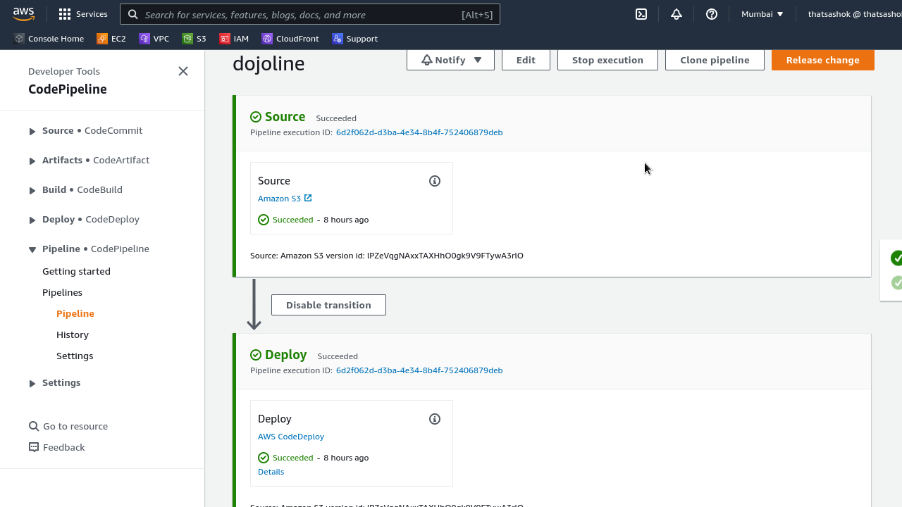
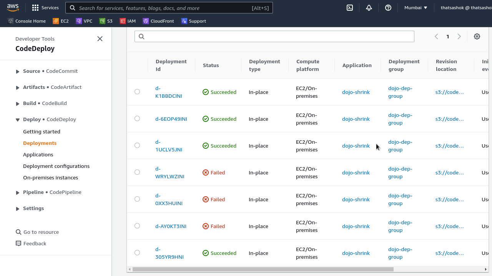

# AWS CodePipeline - Part-1 - Code Deploy - NGINX on EC2

## Introduction

- Task was to read about AWS CodePipeline development tools and deploy a NGINX server with files from S3 bucket

## Cloud Research

- [AWS CodeDeploy](https://docs.aws.amazon.com/codedeploy/latest/userguide/welcome.html)
- [AWS appspec.yml references](https://docs.aws.amazon.com/codedeploy/latest/userguide/reference-appspec-file.html)
- [Installation and set up NGINX for fedora / Amazon Linux](https://devcoops.com/install-nginx-on-aws-ec2-amazon-linux/)

### Deployment today 




### File structure

```
├── appspec.yml
├── app.zip
├── deployscript.sh
├── index.html
└── scripts
    ├── install_nginx
    ├── start_nginx
    └── stop_nginx
```

### Deployment script mix mash of bash and AWS CLI

```bash
#!/usr/bin/env bash

rm app.zip
zip -r app.zip ./*
aws s3 cp app.zip s3://naa-deployment-bucket/app.zip
```

### appspec.yml file used

```yaml
version: 0.0
os: linux

hooks:
  BeforeInstall:
    - location: scripts/install_nginx
      timeout: 300
      runas: root
  AfterInstall:
    - location: scripts/start_nginx
      timeout: 300
      runas: root
  ApplicationStop:
    - location: scripts/stop_nginx
      timeout: 300
      runas: root
```

### Verification of triggers and deployments



## Social Proof

Will post on Discord channel
