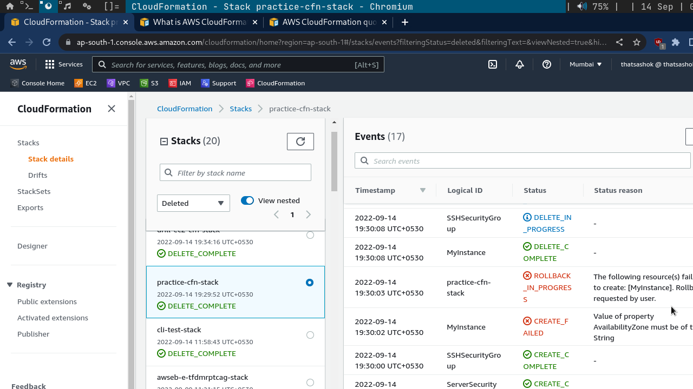
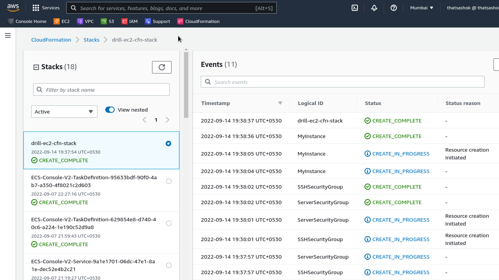
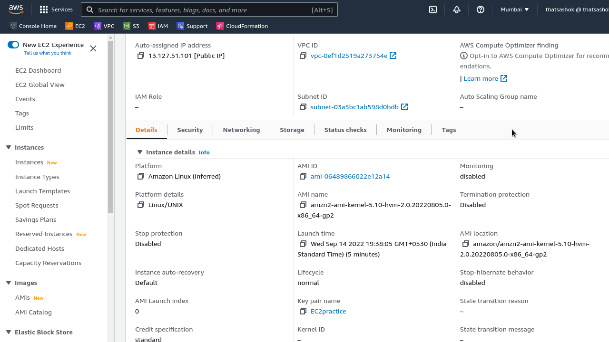
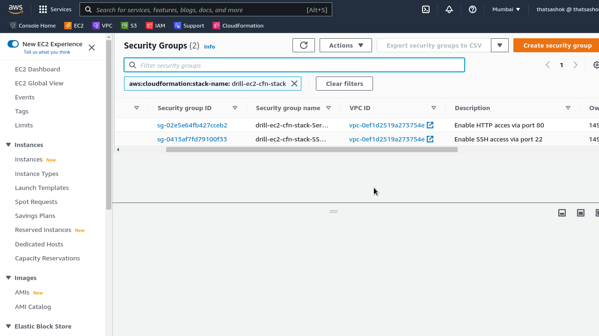

# Day-4 : AWS CloudFormation Kickoff - Fire an EC2 Instance

## Introduction

- Well today I tried to continue the Part-2 for the Day-3 with AWS CodeBuild but free tier account has to apply for limit increase from 0 to 1 for the build projects allowed to run. So raised ticket with AWS Support team.

- Coming back to today's topic, I started to work on more interesting section on Infrastructure as Code (IaC / IaaC) via CloudFormation. This will reduce the steps the list of steps done on AWS Console to text/code in a file. Simple to manage and put under version control.

## Prerequisite

- I believe an basic understanding of AWS core services is needed like EC2 / S3 / VPC and some server admininstration topics.

- Patience to read through pages of well written and open AWS Documentation ;)

## Use Case

- This reduction of numerous steps of console manual actions will be automated execution saving manhours and ensuring consistency.

- Replication of resources deployment is just running a script

- Development environment to Production setup can be done with change of variables / sections in CloudFormation code

## Cloud Research

- Today went through a lot of pages inside the [AWS CloudFormation Guide](https://docs.aws.amazon.com/AWSCloudFormation/latest/UserGuide/Welcome.html) in particular section on Template Reference > Resources and Properties Reference

- I did lot of mistakes while making the template myself, mostly got the datatype wrong as **List** where property requires **String**, which resulted in deployment rollback and failure.



- Did come across feature called ``validate-template`` before deploy in AWS CLI which helped to catch these during later template updates

## Try yourself - Hands On

✍️ Add a mini tutorial to encourage the reader to get started learning something new about the cloud.

### Step 1 — Make template - practice.yaml file

```yaml
---
Parameters:
  SSHKeyName:
    Description: Name of an EC2 KeyPair to enable SSH access
    Type: AWS::EC2::KeyPair::KeyName
    Default: EC2practice

Resources:

  MyInstance:
    Type: AWS::EC2::Instance
    Properties:
      AvailabilityZone: ap-south-1a
      ImageId: ami-06489866022e12a14
      InstanceType: t2.micro
      SecurityGroups:
        - !Ref SSHSecurityGroup
        - !Ref ServerSecurityGroup
      KeyName: !Ref SSHKeyName

  SSHSecurityGroup:
    Type: AWS::EC2::SecurityGroup
    Properties:
      GroupDescription: Enable SSH access via port 22
      SecurityGroupIngress:
      - CidrIp: 0.0.0.0/0
        FromPort: 22
        IpProtocol: tcp
        ToPort: 22

  ServerSecurityGroup:
    Type: AWS::EC2::SecurityGroup
    Properties:
      GroupDescription: Enable HTTP acces via port 80
      SecurityGroupIngress:
      - IpProtocol: tcp
        FromPort: 80
        ToPort: 80
        CidrIp: 0.0.0.0/0
```

### Step 2 - Template Validation

```bash
$ aws cloudformation validate-template --template-body file:///$(pwd)/cloudformation/practice.yaml
```

**Response Output :**

```json
{
    "Parameters": [
        {
            "ParameterKey": "SSHKeyName",
            "DefaultValue": "EC2practice",
            "NoEcho": false,
            "Description": "Name of an EC2 KeyPair to enable SSH access"
        }
    ]
}
```

### Step 3 — Stack Creation output

```bash
$ aws cloudformation create-stack --stack-name drill-ec2-cfn-stack --template-body file:///$(pwd)/cloudformation/practice.yaml
```
**Response Output :**

```json
{
    "StackId": "arn:aws:cloudformation:ap-south-1:***********:stack/drill-ec2-cfn-stack/a06efce0-****-11ed-bf36-06924bac130a"
}
```

### Step 4 — Stack Creation Events and Deployment Verification

**Event Log : Success**



**Instance details check :** Details match for inputs in template - Description of security groups and SSH Key selected properly





** Stack Describe output : ** To check from AWS CLI for deployment details

```bash
$ aws cloudformation describe-stacks --stack-name drill-ec2-cfn-stack
```

**Response Output :**

```json
{
    "Stacks": [
        {
            "StackId": "arn:aws:cloudformation:ap-south-1:***********:stack/drill-ec2-cfn-stack/a06efce0-****-11ed-bf36-06924bac130a"
            "StackName": "drill-ec2-cfn-stack",
            "Parameters": [
                {
                    "ParameterKey": "SSHKeyName",
                    "ParameterValue": "EC2practice"
                }
            ],
            "CreationTime": "2022-09-14T14:07:54.337000+00:00",
            "RollbackConfiguration": {},
            "StackStatus": "CREATE_COMPLETE",
            "DisableRollback": false,
            "NotificationARNs": [],
            "Tags": [],
            "EnableTerminationProtection": false,
            "DriftInformation": {
                "StackDriftStatus": "NOT_CHECKED"
            }
        }
    ]
}
```

## Step-5 : Stack deletion

```bash
$ aws cloudformation delete-stack --stack-name drill-ec2-cfn-stack
```

** Yields no ouput response **

- It is possible to recheck via ``describe-stacks`` and delete considered successful if query returns stack not found.

```bash
$ aws cloudformation describe-stacks --stack-name drill-ec2-cfn-stack
```
## ☁️ Cloud Outcome

- Was able to deploy a EC2 instance with just a single command and repeat it multiple times over without opening web interface and doing manual steps

## Next Steps

- Build on top of this base template and work into complex solutions involving CodePipeline and CodeDeploy, along with other core AWS services.

## Social Proof

Posting on **Discord** channel.
