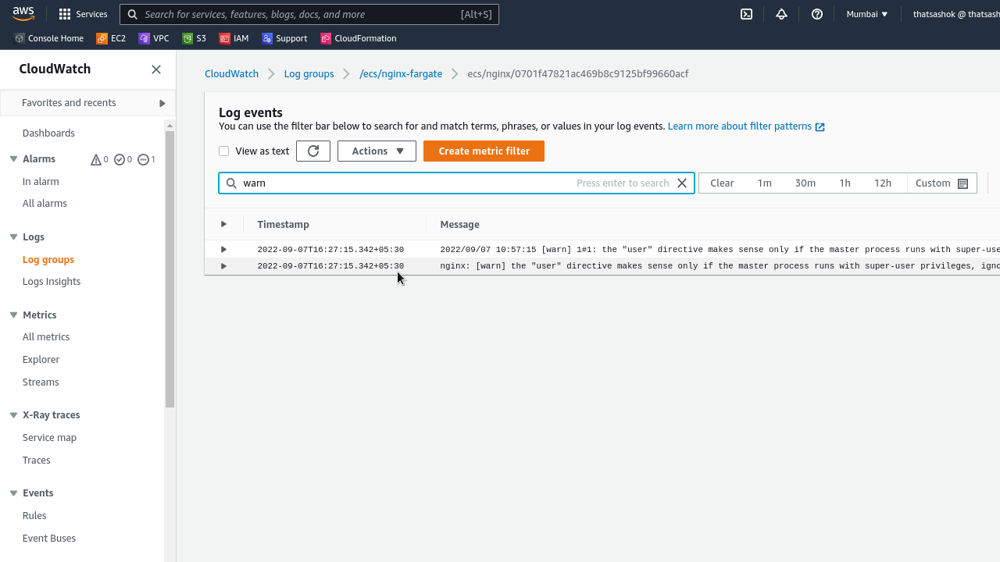
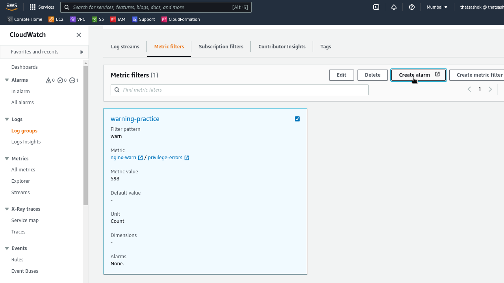
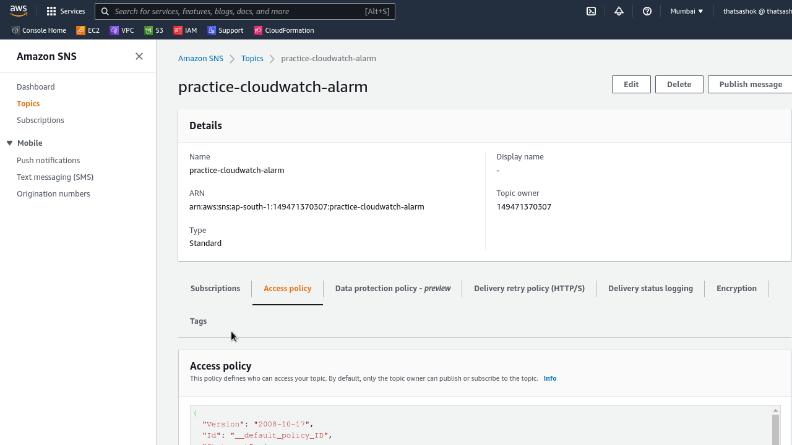
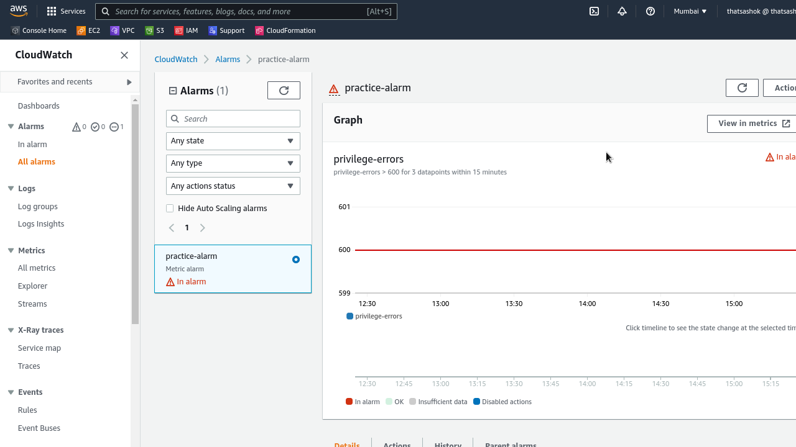
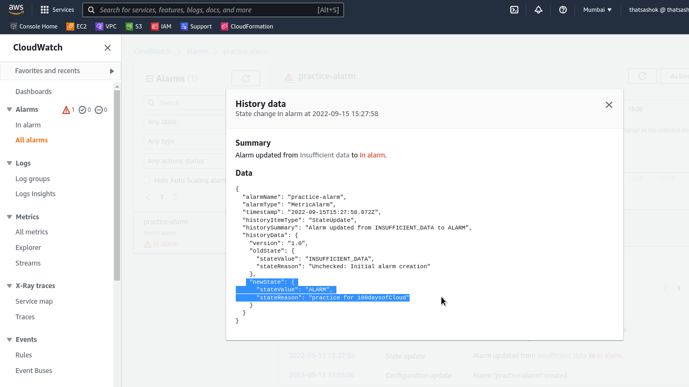
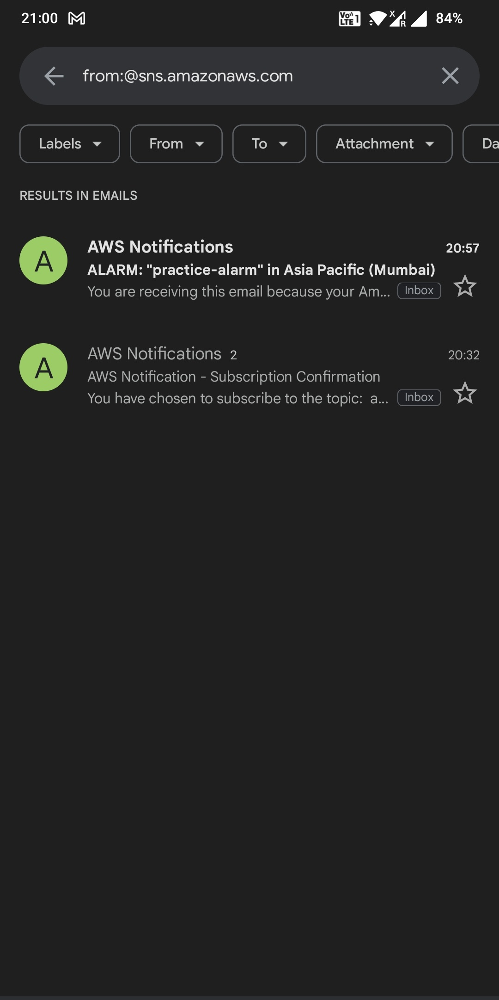

# Day-5 : AWS CloudWatch - Resource Monitoring

## Cloud Research

- Today read through the cloudwatch documentation [here](https://docs.aws.amazon.com/AmazonCloudWatch/latest/monitoring/GettingStarted.html) and worked with Hands on with below topics :
    - CloudWatch Logs (Groups < Streams)
    - Ability to have custom Metric filters and query logs for generating insights
    - CloudWatch custom metrics with CloudWatch Agent
    - CloudWatch alarms with manual trigger testing for ALARM state with SNS topic email

## Hands On

### Step-1 : Set a custom metric filter on any of the log group logs

- I chose to work on ecs-fargate log group I practiced upon earlier
- Added filter for warnings count with pattern matching for 'warn'

**Metric Filter**




### Step-2 : Set a cloudwatch alarm for this custom metric 

- If count of 'warn' metric value > 600 alarm is triggered
- Triggered alarm will send an email via SNS topic for subscribed emails

**Alarm**


**SNS Topic**


### Step-3 : Trigger alarm manually with AWL CLI state change

- Trigger alarm to see that it works without having to wait for threshold to reach and trigger automatically

```bash
$ aws cloudwatch set-alarm-state --alarm-name practice-alarm --state-value ALARM --state-reason 'practice for 100daysofCloud'
```

**Alarm Activated**


**Alarm Event Details**


**SNS Topic trigger email**


## Social Proof

Will post on **Discord** Channel
