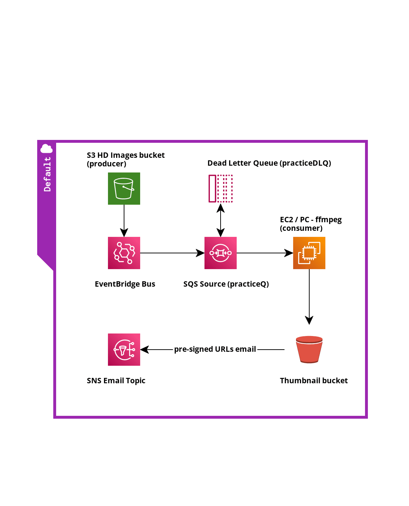
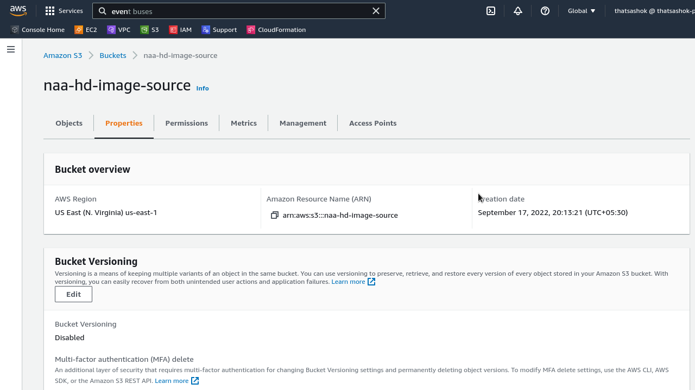
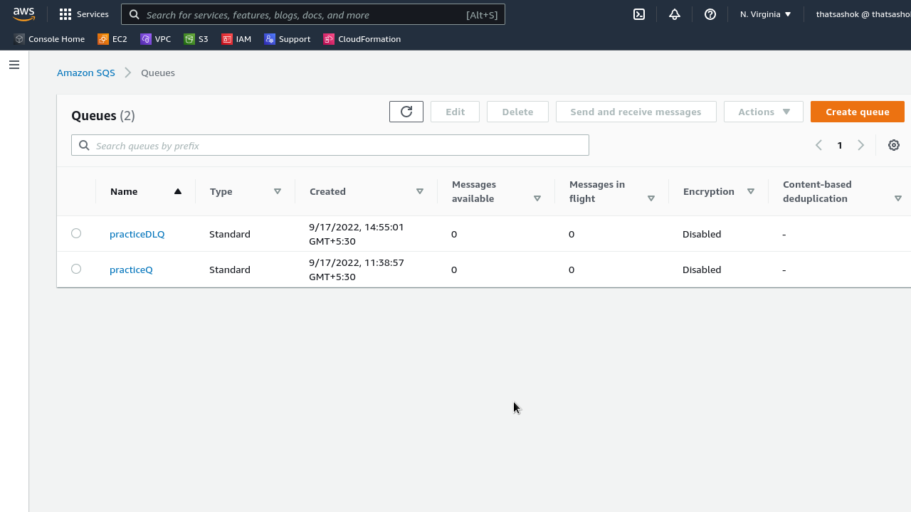

# Day-7 : Part-1 - Setup Architecture for producer/consumer with SQS Queue

## Introduction

- I just want to give a go at visualization at the producer / consumer model with the traditional problem of thumbnail creation for every image uploaded in an S3 bucket. Also wanted to make a diagrammatic representation.

## Prerequisite

- I believe that a simple understanding of concurrencty models with any practice on threading or asyncio models will really help pick up this topic at easily and identify application scenarios.

## Use Case



- Here is my first attempt at diagrammatic representation of the classic solution with AWS ( made @ cloudcraft.co )

- This involves automatic generation of thumbnail for every HD image uploaded in S3 bucket 


## Cloud Research

- Read the AWS documentation on below topics

    - [Amazon EventBridge](https://docs.aws.amazon.com/eventbridge/latest/userguide/eb-event-bus.html)
        - Bus creation
        - Event trigger policy

    - [Amazon SQS Queue](https://docs.aws.amazon.com/AWSSimpleQueueService/latest/SQSDeveloperGuide/sqs-using-sqs.html)
        - Queue Creation
        - Access Policies
        - Send / Receive Messages, Purge Queue
        - Visibilty timeout and its extension
        - Delayed message
        - Long polling
        - Dead Letter Queue
        - Redrive to source
        - API calls
        
## Setup Hands On via console


### Step 1 — Setup desired event trigger

- S3 bucket is upload endpoint for HD images (naa-hd-image-source)
- Any putObject api call will trigger and add event in EventBridge bus




### Step 2 — Summary of Step

- SQS source queue (practiceQ) in same region will keep polling for messages from Resource ARN matching (naa-hd-image-source) bucket name 
- SQS also has a Dead Letter Queue (practiceDLQ) for items that missed the ffmpeg processing within visibility timeout and after 3 retries



**SQS practiceQ Access policy Statement for chosen bucket:**

```json
 {
      "Sid": "AWSEvents_HD-image-upload-trigger_Id9d1c69f9-18e1-42c1-a554-548d9e6a4331",
      "Effect": "Allow",
      "Principal": {
        "Service": "events.amazonaws.com"
      },
      "Action": "sqs:SendMessage",
      "Resource": "arn:aws:sqs:us-east-1:************:practiceQ",
      "Condition": {
        "ArnEquals": {
          "aws:SourceArn": "arn:aws:events:us-east-1:************:rule/HD-image-upload-trigger"
        }
      }
}
```

## Next Steps

- EC2 or my Laptop will pull the message details, extract object name and download via AWS CLI
- Bash script will run on this file causing ffmpeg to reduce image to 64x64 pixels (PNG) thumbnail
- Upload the thumbnail to another S3 bucket with different lifecycle policy
- Generate preSigned URL for this new thumbnail and email it to subscribers via SNS

## Social Proof

- Will post on **Discord** channel
