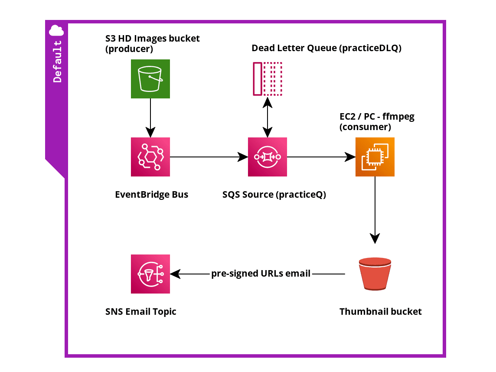
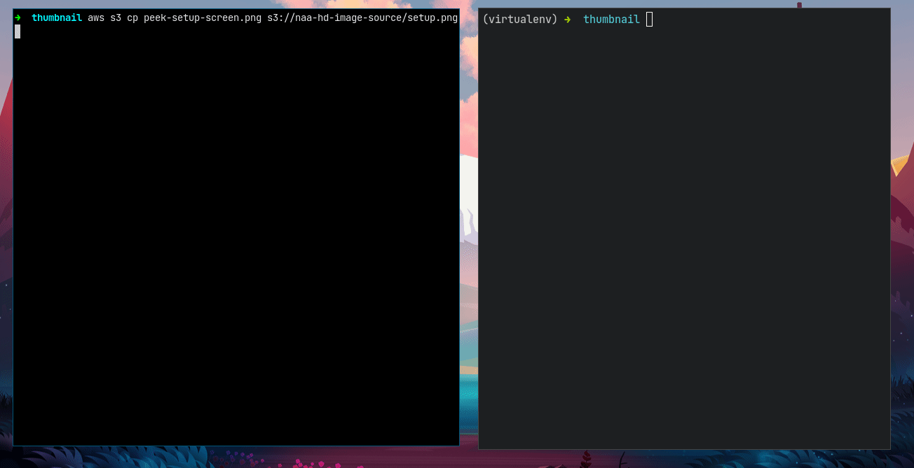
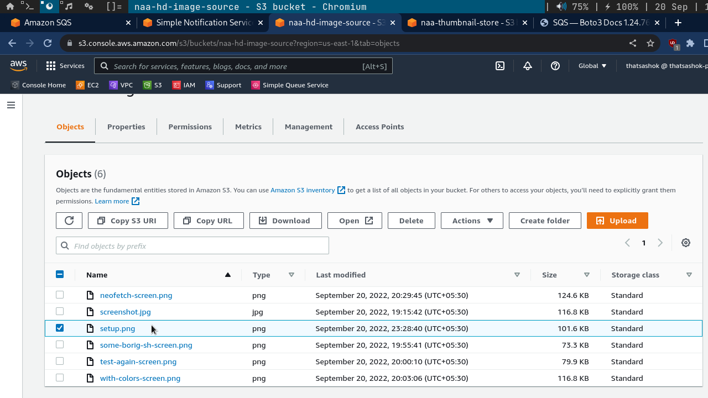
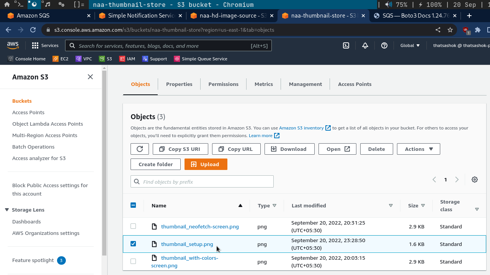
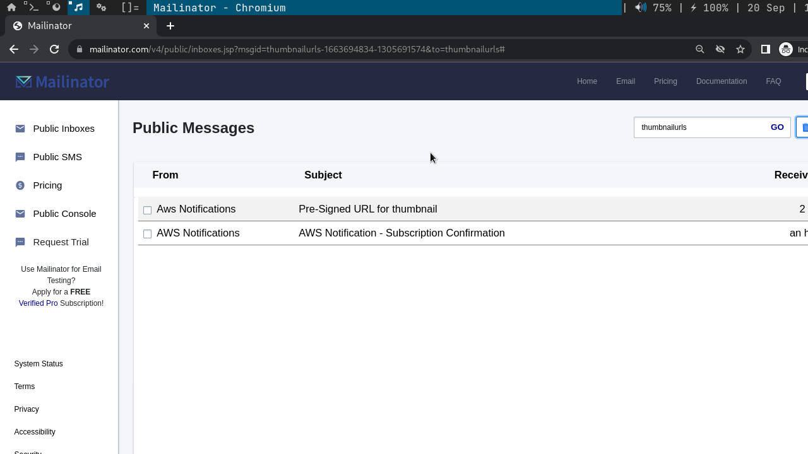
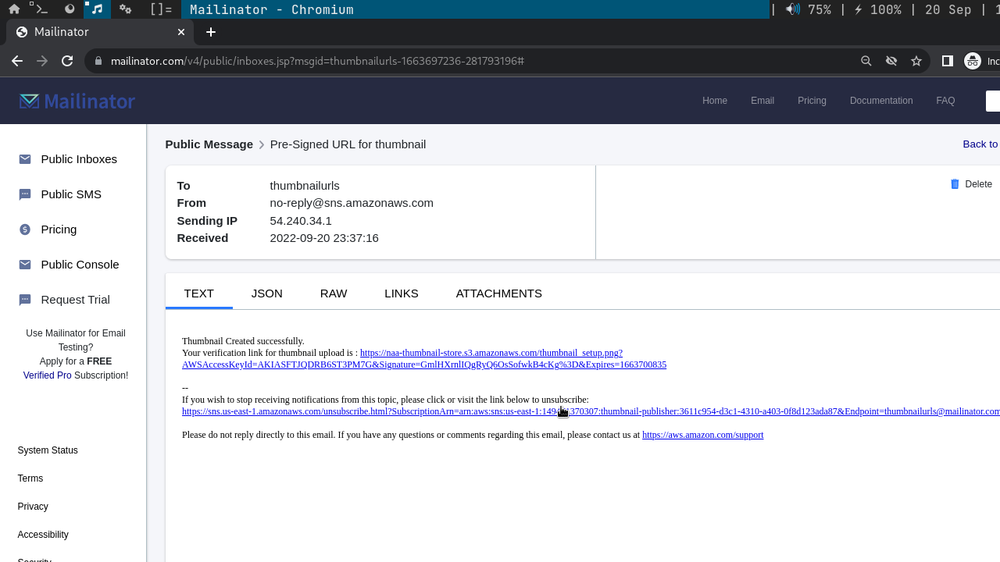

# Day-9 : Part-3 - Integration code completion and demo / testing

## Introduction

- Today's post is in continuation to the Thumbnail generator coding using SDK for architecture integration and demo of the working code to mark it ready for deployment

### Architecture




## Prerequisite

- Understanding of python dictionaries and functions / loops, ability to use external libraries

- AWS services in use for this project - SNS, SQS, S3 and their functionalities to pick from SDK and integrate into the code

## Use Case

- Thumbnail generation for profile pictures, album arts for songs/music albums from input HD images

## Cloud Research

- Understanding the difference between SDK services
    - [Low-level client] (https://boto3.amazonaws.com/v1/documentation/api/latest/guide/clients.html)
    - [Resource](https://boto3.amazonaws.com/v1/documentation/api/latest/guide/resources.html) 

- Difficulty in obtaining the required topic ARN for SNS with Topic Name
    - Currently implemented with picking from single entry of `list_topics` client method

- Used too much variables with pass by value instead of doing by OOPs way of pass by reference with hardcoded regions. 

- Studied today on Amazon Kinesis services

- Kickstarted Lambda Serverless compute

## Working Demo

**Click to see code**

<details>
  <summary>View Code</summary>
  
  ```python

    #!/usr/bin/env python

    import json
    import boto3
    from botocore.exceptions import ClientError
    from PIL import Image
    import mimetypes


    def get_queue(q_client, sourceQ):

        # Get the queue url
        q_url_response = q_client.get_queue_url(QueueName=sourceQ)
        q_url = q_url_response['QueueUrl']

        #print(f'QueueURL = {q_url}')

        return q_url


    def send_email(url):

        sns = boto3.client('sns', region_name='us-east-1')

        # print(json.dumps(sns.list_topics(),indent=4))

        arn = sns.list_topics()['Topics'][0]['TopicArn']

        publish_response = sns.publish(
                TopicArn=arn,
                Subject='Pre-Signed URL for thumbnail',
                Message=f"Thumbnail Created successfully.\nYour verification link for thumbnail upload is : {url}"
                )

        if publish_response['ResponseMetadata']['HTTPStatusCode'] == 200:
            print(f"Email send Successfully with MessageId {publish_response['MessageId']}")


    def image_reduction(s_bucket, t_bucket, sourcefile, thumb_size):

        url=None
        local_file = "/tmp/" + sourcefile
        thumbnail_image = "thumbnail" + "_" + sourcefile

        # download file from source bucket
        s_bucket.download_file(sourcefile, local_file)

        # read content type from downloaded file to maintain
        # same in thumbnail
        filetype, encoding = mimetypes.guess_type(local_file)

        # reduce image size in place - using thumbnail function 
        # instead of resize function
        try:
            img = Image.open(local_file)
            img.thumbnail(thumb_size)
            img.save(thumbnail_image)

            # Upload to thumbnail bucket
            t_bucket.upload_file(
                    Key=thumbnail_image,
                    Filename=thumbnail_image,
                    ExtraArgs={'ContentType': filetype }
                    )

            # Fetch the presigned URL for uploaded file

            s3 = boto3.client('s3', region_name='us-east-1')

            url = s3.generate_presigned_url(
                    ClientMethod='get_object',
                    Params={'Bucket':'naa-thumbnail-store', 'Key':thumbnail_image},
                    ExpiresIn=3600)

            send_email(url)

        except ClientError as error:

            print('Failed Image processing or upload')
            print(error)


    def process_queue(q_client, q_url, s_bucket, t_bucket, thumb_size):

        '''
        Reference the client or use session based client for this operation ?
        '''

        print("Polling for messages...............")

        msg_response = q_client.receive_message(
            QueueUrl=q_url,
            MaxNumberOfMessages=5,
            VisibilityTimeout=30,
            WaitTimeSeconds=15
        )

        try:
            print(f"Received {len(msg_response['Messages'])} messages")

            for message in msg_response['Messages']:

                mbody = json.loads(message['Body'])
                s3_object_name = mbody['detail']['object']['key']
                msg_rhandle = message['ReceiptHandle']

                # Do image reduction to thumbnail
                image_reduction(s_bucket, t_bucket, s3_object_name, thumb_size)

                print('Processing message completed.....Deleting message from queue')
                del_response = q_client.delete_message(
                        QueueUrl = q_url,
                        ReceiptHandle = message['ReceiptHandle'],
                        )

                print(json.dumps(del_response,indent=4))

        except KeyError:
            
            print('No messages in Queue..Poll again or check Dead Letter Queue list')
            # print(json.dumps(msg_response,indent=4))


    if __name__ == '__main__':

        region='us-east-1'
        sourceQ='practiceQ'
        source_bucket='naa-hd-image-source'
        thumb_bucket='naa-thumbnail-store'
        thumb_size=(64,64)

        # Setup the sqs client
        q_client = boto3.client('sqs',region_name=region)

        # setup s3 resource
        s3 = boto3.resource('s3')

        # map source bucket resources
        s_bucket = s3.Bucket(source_bucket)
        t_bucket = s3.Bucket(thumb_bucket)

        # start process

        q_url = get_queue(q_client, sourceQ)

        # while True:
        process_queue(q_client, q_url, s_bucket, t_bucket, thumb_size)

  ```
</details>

**Demo GIF**



### Breakdown 1 — File in Source S3 bucket from CLI



### Breakdown 2 — File in Destination Thumbnail S3 bucket



### Breakdown 3 — Email with presigned URL arrives





## ☁️ Cloud Outcome

- Able to automate the Upload of image to S3 bucket, generate its thumbnail and uploading thumbnail to its own bucket in addition notifying end user with a preview link of thumbnail for confirmation

## Next Steps

- Make this work on AWS Lambda serverless and aim to minimize memory foot print for the code to run

## Social Proof

Will post on **Discord** channel - 100DaysofCloud
