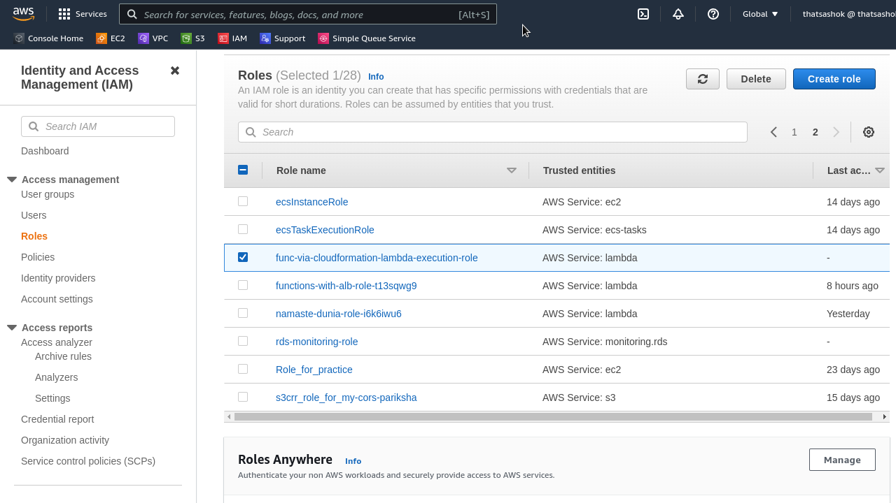

# Day-10 : CloudFormation - Serverless Lambda Function

## Introduction

- This exercise is part of combining spaced repitition training for cloudformation templating IaC and new concepts that I learnt today about serverless function AWS Lambda

## Prerequisite

- Python - Writing functions and using json library
- AWS Lambda
- YAML
- CloudFormation AWS CLI commands
- Patience to go through Cloudformation template reference and manually make template from scratch

## Use Case

- Automatically deploy and remove serverless function as a scheduled job

## Cloud Research

- [CloudFormation Reference AWS::Lambda::Function](https://docs.aws.amazon.com/AWSCloudFormation/latest/UserGuide/aws-resource-lambda-function.html)

- [CloudFormation Reference AWS::IAM::Role](https://docs.aws.amazon.com/AWSCloudFormation/latest/UserGuide/aws-resource-iam-role.html)

## Try yourself

### Step 1 — Make Template with necessary Resources and Parameters

```yaml
---
Parameters:
  Function:
    Description: name of the lambda function
    Type: String
    Default: func-via-cloudformation

Resources:
  MyServerlessFunction:
    Type: AWS::Lambda::Function
    Properties:
      FunctionName: !Ref Function
      Description: Serverless function to return timezones
      Architectures:
        - x86_64
      Role: !GetAtt MyLambdaExecRole.Arn
      Handler: index.handler
      Timeout: 3
      Code:
        ZipFile: |
          import time
          def handler(event, context):
            normal, dst = time.tzname
            return {
              'statusCode': 200,
              'TimeZoneNormal': normal,
              'TimeZoneDST': dst
              }

  MyLambdaExecRole:
    Type: AWS::IAM::Role
    Properties:
      RoleName: 
        !Join 
          - '-'
          - - !Ref Function
            - lambda
            - execution
            - role
      Description: Lambda function execution role
      AssumeRolePolicyDocument:
        Statement:
          - Effect : Allow
            Principal:
              Service: 
                - lambda.amazonaws.com
            Action:
              - 'sts:AssumeRole'
```

### Step 2 — Validate Template

```console
$  aws cloudformation validate-template --template-body file:///$(pwd)/practice.yaml
```

**Output :**

```json
{
    "Parameters": [
        {
            "ParameterKey": "Function",
            "DefaultValue": "func-via-cloudformation",
            "NoEcho": false,
            "Description": "name of the lambda function"
        }
    ],
    "Capabilities": [
        "CAPABILITY_NAMED_IAM"
    ],
    "CapabilitiesReason": "The following resource(s) require capabilities:
[AWS::IAM::Role]"
}
```

### Step 3 — Create stack with CAPABILITY_NAMED_IAM

```console
$  aws cloudformation create-stack --stack-name lambda-py-tz --template-body file:///$(pwd)/practice.yaml --capabilities CAPABILITY_NAMED_IAM
```

**Response Output :**

```json
{
    "StackId": "arn:aws:cloudformation:ap-south-1:************:stack/lambda-py-tz/59b4a600-39d2-11ed-aa13-0279fc3e6c92"
}
```

### Stack Created


### Role Created



### Function Created


### Function Code Loaded


### Function Result Working


## ☁️ Cloud Outcome

- Able to create Role and Lambda function infrastructure as code from cloudformation

- LessonsLearned

    - CAPABILITY_NAMED_IAM error if not explicity specified in stack creation
    
    - Typo error caused roll back for 
        - using Zipfile instead of **ZipFile**

    - Keyword Pattern failure for ARN caused roll back
        - used `Role : !Ref MyLambdaRole` instead of `Role: !GetAtt MyLambdaExecRole.Arn`

## Next Steps

- Keep adding on this provisioning with ALB and Asynchronous Lambda invocations

## Social Proof

- Will post on **Discord** for 100DaysofCloud and LearntoCloud
