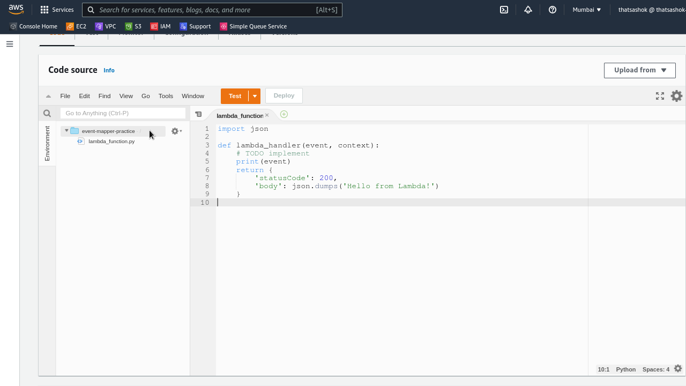
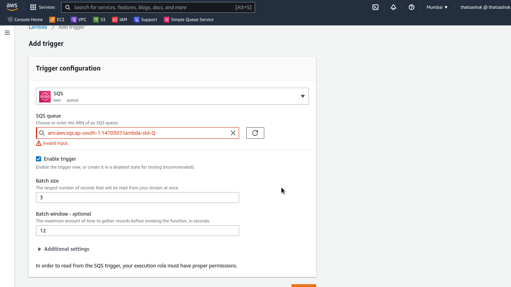
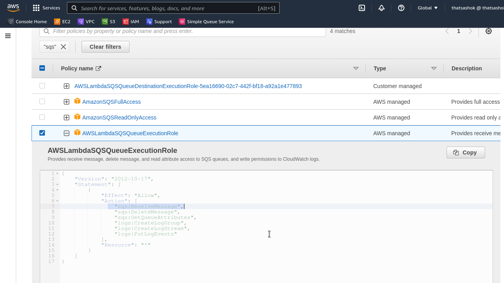
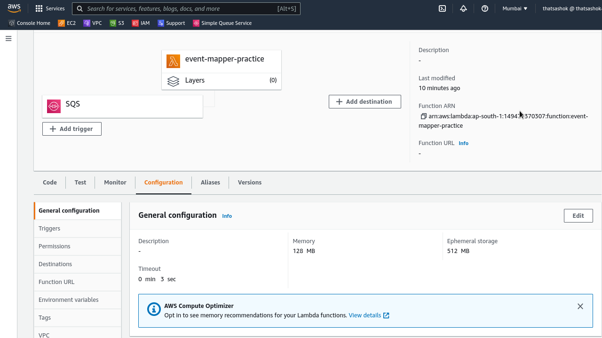
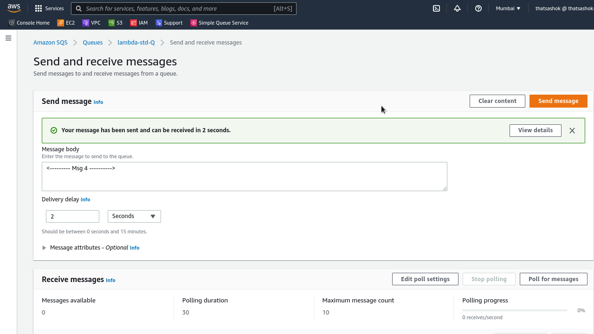
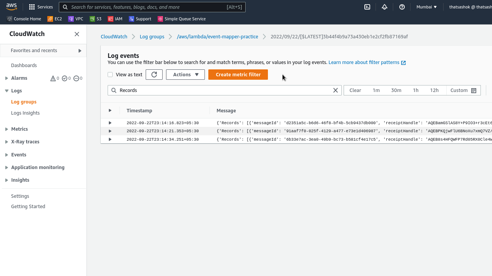

# Day-11 : AWS Lambda - Invocation types and Event Source Mapping

## Introduction

- Today the work went into understandin AWS triggers for Lambda service and invoke the Lambda functions 

- Types of invocation - synchronous and asynchronous

## Prerequisite

- AWS SQS / SQS FIFO
- AWS Kinesis Data Streams
- AWS Lambda

## Use Case

- A combination of Event triggers and Lambda functions can be used to do live tasks or scheduled tasks based on need.

    - **Live Task example** - Filter stream of website click data into NAV section and Sitemap section from Kinesis data stream using Lambda function
    - **Scheduled / Cron job** - Trigger a Lambda function every 6 hours to read logs and generate a non standard metric stat and push an email

## Cloud Research - My Notes

- [AWS Lambda - Asynchronous Invocation](https://docs.aws.amazon.com/lambda/latest/dg/invocation-async.html)

    - Events are placed in an **internal event queue**

    - Lambda function pulls from queue and tries to process each event

    - Function starts processing and returns **202 status code**.

    - Will **not say** success or failure

        - Function **doesn't wait** for response to return.

        - Moves on to next event or retry on same event

        - No blocking - **hence asynchronous**

- [Lambda - Event Source Mapping](https://docs.aws.amazon.com/lambda/latest/dg/invocation-eventsourcemapping.html)

    - For these type of triggers Lambda service will **poll** for events from source

    - Lambda polls and receives **event batch**. ESM will send **Invoke batch** to Lambda function

    - Use batches to work - **batch window** time, **batch size** of records, **batch size** of memory

    - Allowed Event Sources

        - **Streams** - Asynchronous Invocations

            - Kinesis Data Streams

            - DynamoDB Streams

        - **Queues** - Synchronous invocations

            - SQS & SQS FIFO queue

## Hands On - SQS Event to Lambda invocation

### Step 1 — Create Lambda function

### Step 2 — Create Event Source - SQS Standard Queue

- Batch size - 3 messages

- Batch Window - 12 secs

- Don't Forget to add ``ReceiveMessage`` API acces by attaching policy to IAM role

### Step 3 — Adjust Function timeout with Visiibility timeout of SQS message

- I set the lambda function timeout to 20 seconds because lesser value resulted in execution drops

## Step-4 - Checking Cloudwatch logs for delivered messages

- I sent 4 messages from SQS but received only 3 in Cloudwatch. Since I set batch size to 3 messasges. 4th message will still be with Event Mapperand may get lost in case not used.

**CloudWatch Tally**

## ☁️ Cloud Outcome

- Able to work based on triggers from SQS events with control of batches and batch window for low cost operation

## Next Steps

- Integrate this into a project for demo

## Social Proof

Will post on **Discord**
