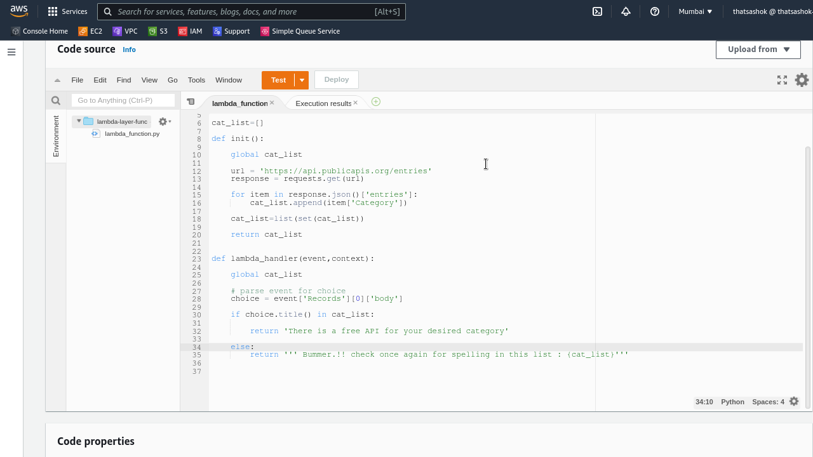
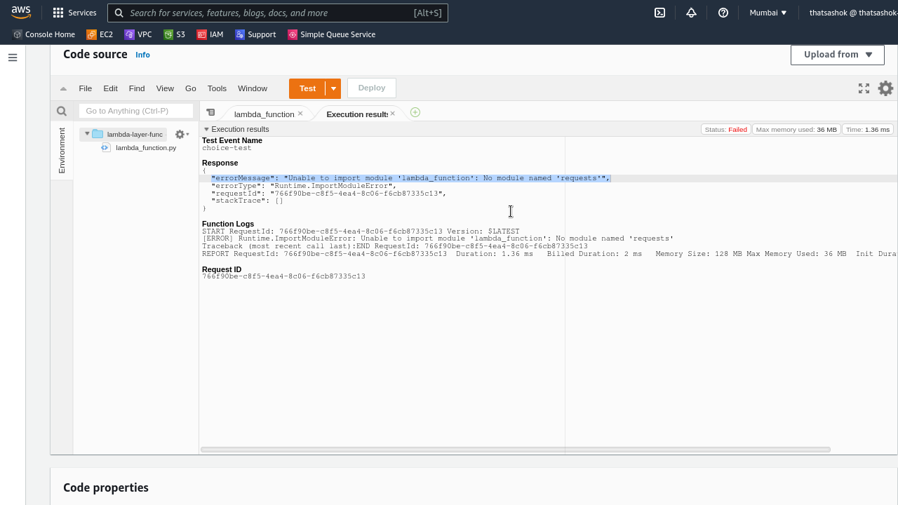
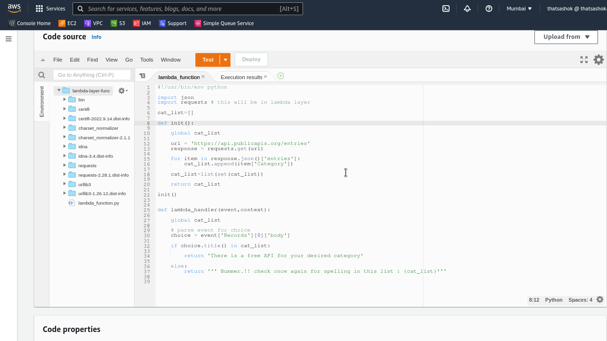
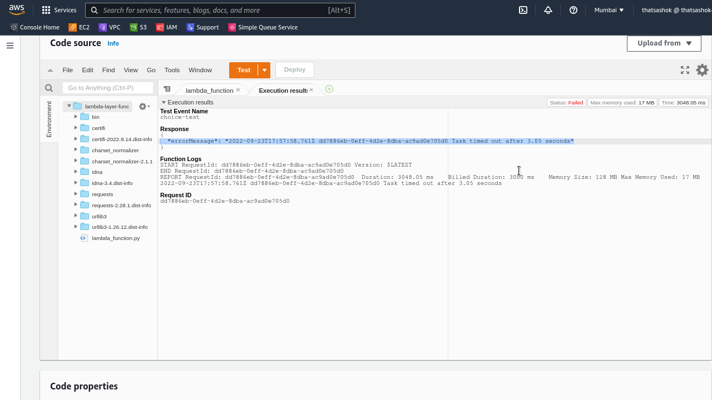

# Day-12 : Lambda with external dependencies - Deployment Packages

## Introduction

- Today's practice topic is on including external dependencies with the python code for reuse in two ways
    - With single function code zip package
    - As a Lambda Layer

## Use Case

- Reduction in size of uploaded code since it reuses already existing libraries in layers thereby reducing deployment time and increasing execution speed

## Cloud Research

- [AWS Lambda Layers Documentation](https://docs.aws.amazon.com/lambda/latest/dg/configuration-layers.html)
    - Works only with Lambda functions where code is deployed as .zip archive. Will not work with inline code in CloudFormation
    - Max 5 Layers allowed
    - Layer Unzipped size allowed is 250 MB 
    - All language builtin packages are available
    - SDK related packages are available and updated

## Hands On

### Without Dependencies



**Import Module Error**



### Loading dependencies along with code

```console
$ pip install --target=./package requests
```

```console
$ tree -L 1 package
.
├── bin
├── certifi
├── certifi-2022.9.14.dist-info
├── charset_normalizer
├── charset_normalizer-2.1.1.dist-info
├── idna
├── idna-3.4.dist-info
├── lambda_function.py
├── lambda-layer-func.zip
├── requests
├── requests-2.28.1.dist-info
├── urllib3
└── urllib3-1.26.12.dist-info
```

**Load this code into function**

```console
$ aws lambda update-function-code --function-name lambda-layer-func --zip-file fileb://lambda-layer-func.zip
```

**Code with Dependencies**



**WORKS - But Function Timed Out - Mistake in VPC/NAT Config**



## Lessons Learnt

- Internet access mistake not configured NAT Instances in VPC

## Social Proof

- Will post on **Discord** Channel - #100DaysofCloud and #LearntoCloud
