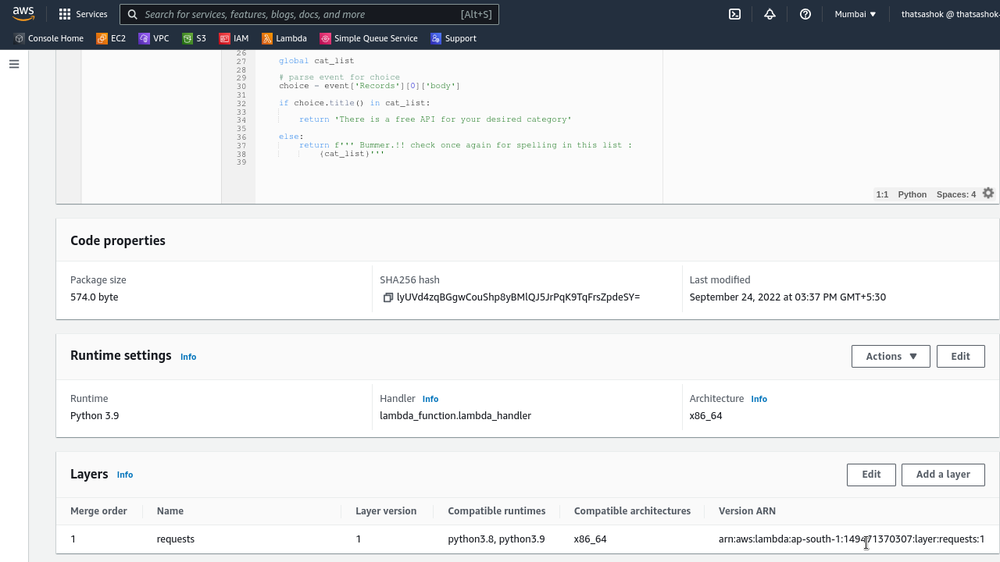

# Day-13 : Fix Internet access, Lambda Layers, Versions and Aliases

## Introduction

- Fix internet access issue to the Lambda function created yesterday while touching upon next manner of keeping dependencies off main code deployment package while leveraging function of Lambda layers and recording changes with function versions and layers. 

## Use Case

- Get internet resource data for processing on Lambda
- Using layers for quicker execution of code
- Versions and Layers for control and deployment strategies with Code Deployment feature

## Cloud Research

- I understood the documentation that deals with Lambda networking and tried to create a VPC + NAT Gateway complicated arrangement which failed to execute the code due to timeout. Removing the VPC configuration resolved the Internet Access error

    - [Lambda Networking](https://docs.aws.amazon.com/lambda/latest/dg/foundation-networking.html)
    - [Ticket Question](https://aws.amazon.com/premiumsupport/knowledge-center/internet-access-lambda-function/)

- **Aliases & Versions**

    - Versions

        - When we publish a code with configuration , it becomes a VERSION
        - Versions are immutable and in increasing order of numbering


    - Aliases

        - Similar to pointers to a function version
        - Aliases are mutuable, similar to git pointer HEAD
        - Facilitate enable deployments by assigning weights to function versions
        - Aliases cannot reference other aliases

## Hands On


### Step-1 : Create zip file with packages required and upload to layer in Lambda

**Get dependencies together :**

```console
$ pip install --target=python requests
```

**File structure :**

```console
python
├── bin
├── certifi
├── certifi-2022.9.14.dist-info
├── charset_normalizer
├── charset_normalizer-2.1.1.dist-info
├── idna
├── idna-3.4.dist-info
├── requests
├── requests-2.28.1.dist-info
├── urllib3
└── urllib3-1.26.12.dist-info
```

**Zip files and upload to Layer :**


### Step-2 : Update function code to include only core code

```console
$ zip app lambda_function.py
$ aws lambda update-function-code --function-name lambda-layer-func --zip-file fileb://app.zip
```

### Step-3 : Link the created layer to Lambda Function



### Step-4 : Save the configuration as Version


### Step-5 : Save the configuration as Version


### Step-6 : Finally time to test

**Test Case : SQS Event Format**

```json
{
  "Records": [
    {
      "messageId": "19dd0b57-b21e-4ac1-bd88-01bbb068cb78",
      "receiptHandle": "MessageReceiptHandle",
      "body": "finance",
      "attributes": {
        "ApproximateReceiveCount": "1",
        "SentTimestamp": "1523232000000",
        "SenderId": "123456789012",
        "ApproximateFirstReceiveTimestamp": "1523232000001"
      },
      "messageAttributes": {},
      "md5OfBody": "{{{md5_of_body}}}",
      "eventSource": "aws:sqs",
      "eventSourceARN": "arn:aws:sqs:us-east-1:123456789012:MyQueue",
      "awsRegion": "us-east-1"
    }
  ]
}
```

**Code : Parse SQS Message Body and check if same category exists in list of public APIs**

```python
#!/usr/bin/env python

import json
import requests # this will be in lambda layer

cat_list=[]

def init():

    global cat_list

    url = 'https://api.publicapis.org/entries'
    response = requests.get(url)

    for item in response.json()['entries']:
        cat_list.append(item['Category'])

    cat_list=list(set(cat_list))

    return cat_list
    
init()


def lambda_handler(event,context):

    global cat_list

    # parse event for choice
    choice = event['Records'][0]['body']

    if choice.title() in cat_list:
        
        return 'There is a free API for your desired category'

    else:
        return f''' Bummer.!! check once again for spelling in this list : 
            {cat_list}'''
```

**Success Response :**


**Failed Response :**


## Social Proof

- Will post on **Discord** in 100daysofCloud and LearntoCloud
