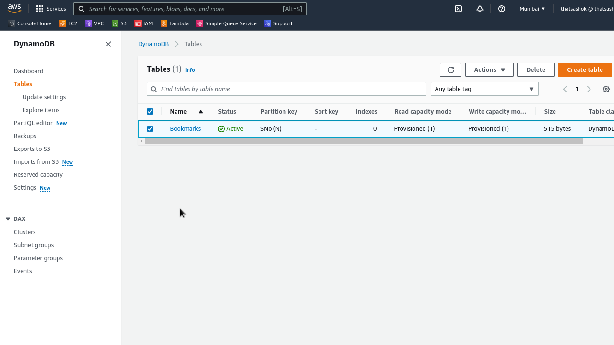
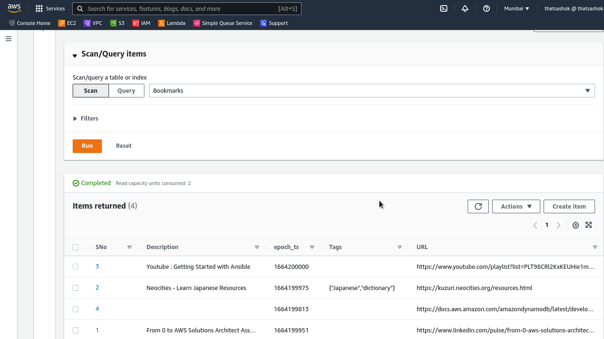
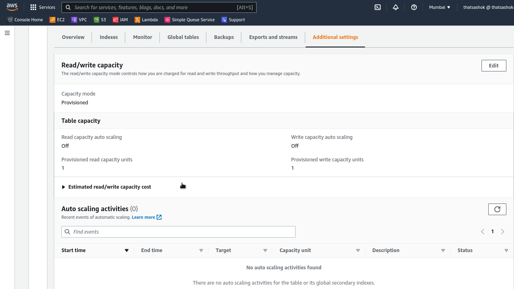

# Day-14 : DynamoDB basics - Tables, RCU, WCU and Indexes

## Introduction

- Today worked with DynamoDB documentation and gone through some important topics hands on about index creation and how RCU and WCU are calculatedfor a workload, request operation wise.

## Cloud Research

- DynamoDB offers both Managed On-Demand and Provisioned setup for users. Most important understanding of provisioning is working out how WCU and RCU throughput estimation is to be done 

- **DynamoDB - WCU**

    - One write capacity unit, 1 WCU represents

    - one write per second

    - for item of size 1 KB

    - item > 1 KB rounded to upper KB value

- **DynamoDB - RCU**

    - One Read capacity unit, 1 RCU represents

    - one strongly consistent read per second. (2 x eventually consistent reads / second)

    - for item of size 4 KB

    - item > 4 KB rounded to upper 4 KB value

- **Types of Read**

    - Eventually Consistent Read (default)

    - Strongly Consistent Read

## Hands On today

### Created a DynamoDB table for project 'Bookmarks'










### Understanding CLI calls to the Table 

```console
$ aws dynamodb get-item --table-name Bookmarks --key='{"SNo":{"N":"2"}}' --return-consumed-capacity TOTAL
```
**Response**

```json
{
    "Item": {
        "SNo": {
            "N": "2"
        },
        "Description": {
            "S": "Neocities - Learn Japanese Resources"
        },
        "epoch_ts": {
            "N": "1664199975"
        },
        "Tags": {
            "SS": [
                "Japanese",
                "dictionary"
            ]
        },
        "URL": {
            "S": "https://kuzuri.neocities.org/resources.html"
        }
    },
    "ConsumedCapacity": {
        "TableName": "Bookmarks",
        "CapacityUnits": 0.5
    }
}
```


## Social Proof

- Will post on **Discord** - 100daysofCloud and LearntoCloud
