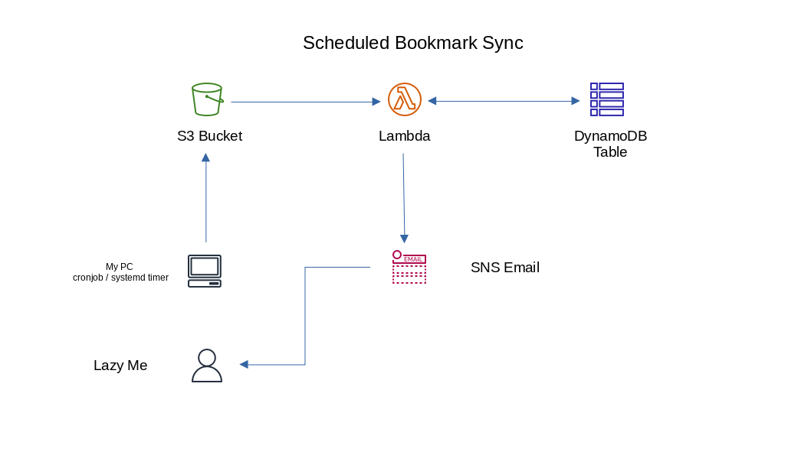

# Day-15 : Part-1 - Bookmarks Sync - Architecture plan and Cloudformation Nested stacks

## Introduction

- The aim of this project is to :

    - revise CloudFormation and try out its nested stack implementation, export and import variables
    - make real world use case implementation of Lambda functions
    - learn use of DynamoDB for Long term Bookmarks URL storage



## Prerequisite

- Understanding of CloudFormation templates and available parameters/ properties for each resource
- Working of Lambda functions
- Python
- DynamoDB

## Use Case

- The aim is to store my Firefox bookmarks which are having bad time syncing even with Firefox account sync and place them in central location so that I can get the links on my website without hassle of logins and be able to use my bookmarks from any computer

## Cloud Research

- Finished reading about [working of DAX clusters](https://docs.aws.amazon.com/amazondynamodb/latest/developerguide/DAX.concepts.html) today and their differentiation for item and query cache and its implementation comparison with Redis/Elasticache

- Dabbled sometime with [best practices in using CloudFormation](https://docs.aws.amazon.com/AWSCloudFormation/latest/UserGuide/best-practices.html) and tring to implement on this


## Hands On

### Step 1 — Setup for Nested Stack style

```console
.
├── cfn-root-stack.yaml
├── nested-lambda.yaml
└── nested-s3Bucket.yaml

```

### Step 2 — Prepare the files & read lots of Documentation

**Root Stack**
```yaml
---
Properties:
  NestedStackName:
    Type: String
    Default: BookmarksRootStack
    Description: Name of the root stack nesting individual stacks

Resources:
  LambdaStack:
    Type: AWS::Cloudformation::Stack
    Properties:
      TemplateURL: nested-lambda.yaml

  S3Stack:
    Type: AWS::Cloudformation::Stack
    Properties:
      TemplateURL: nested-s3Bucket.yaml
```


**S3 Stack**
```yaml
---
Parameters:
  bucketName:
    Type: String
    Description: Name of the S3 bucket to hold bookmarks base file
    Default: demo-book-store

Resources:
  BookmarksBucket:
    Type: AWS::S3::Bucket
    Properties:
      BucketName: !Ref bucketName
      VersioningConfiguration:
        Status: Enabled
      NotificationConfiguration:
        LambdaConfiguration:
          - Event: s3:ObjectCreated:Put
            Function: !ImportValue CreatedFunctionName

Outputs:
  S3BucketDetails:
    Description: Exporting created bucket details for the stack
    Value: !GetAtt BookmarksBucket.Arn
    Export:
      Name: S3BucketNameArn
```


**Lambda Stack - Rebuilding from previous template**
```yaml
---
Parameters:
  Function:
    Description: name of the lambda function
    Type: String
    Default: bookmark-sync-dynamo
  S3BucketParam:
    Type: String
    Default: book-sync-source
  S3KeyParam:
    Type: String
    Default: code.zip
  S3ObjectVersionParam:
    Type: String
    Default: << Should you use this ?? >>

Resources:
  MyServerlessFunction:
    Type: AWS::Lambda::Function
    Properties:
      FunctionName: !Ref Function
      Description: Serverless function to update bookmarks db
      Architectures:
        - x86_64
      Runtime: python3.9
      Role: !GetAtt MyLambdaExecRole.Arn
      Handler: index.handler
      Timeout: 3
      Code:
        S3Bucket: !Ref S3BucketParam
        S3Key: !Ref S3KeyParam
        S3ObjectVersion: !Ref S3ObjectVersionParam

  MyLambdaExecRole:
    Type: AWS::IAM::Role
    Properties:
      Description: Lambda function execution role
      RoleName: 
        !Join 
          - '-'
          - - !Ref Function
            - lambda
            - execution
            - role
      AssumeRolePolicyDocument:
        Statement:
          - Effect : Allow
            Principal:
              Service: 
                - lambda.amazonaws.com
            Action:
              - 'sts:AssumeRole'
            Permissions:
              ---WIP here---

Outputs:
  FuncDetails:
    Description: Details of created lambda function to work with S3
    Value: !GetAtt MyServerlessFunction.Arn
    Export:
      Name: CreatedFunctionName
```

## Next Steps

- Finish templates for DynamoDB, SNS
- Validate and do test stack deployments
- If possible work on python script for Lambda function

## Social Proof

- Will post on **Discord** channels - 100daysofCloud & LearntoCloud
