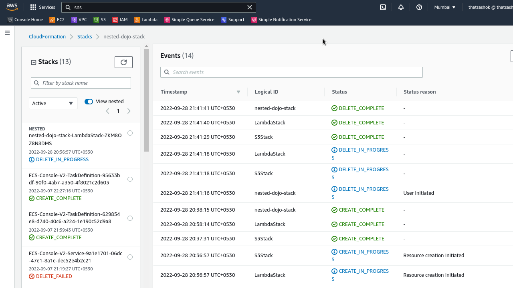
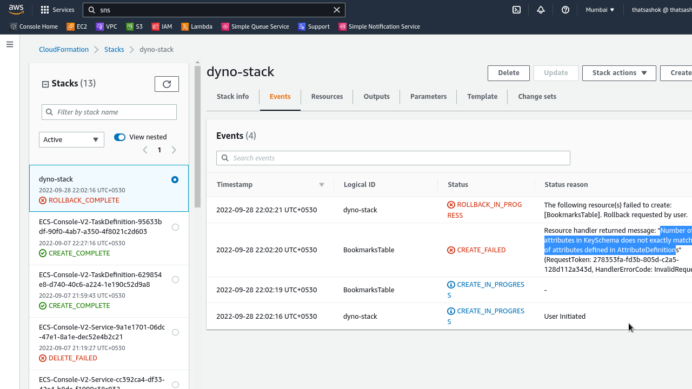

# Day-16 : Part-2 - Bookmarks Sync - Resolved Cloudformation issues with Testing

## Updates for Part-2 :

### Completed writing templates for all resources

- Finished writing templates for SNS Topic creation and DynamoDB Table
- Lots of correction and hair-pulling time went into understanding and correcting IAM managed roles for lambda template

**Files uploaded in Repo as well**

```console
➜  book-sync tree .
.
├── cfn
│   ├── cfn-root-stack.yaml
│   ├── nested-dynamodb.yaml
│   ├── nested-lambda.yaml
│   ├── nested-s3Bucket.yaml
│   ├── nested-sns-topic.yaml
│   └── ship-it.sh
└── code
    ├── code.zip
    └── lambda_function.py

2 directories, 8 files
```

### Testing - finally works with Nested Stack 

**Nested Stack Creation to Deletion Event Log**




## ☁️ Cloud Outcome - Lessons Learned

- **Import variables** still could not figure out as there are cross referencing during stack creation time and causing roll backs

- Decided best strategy is to **deploy first** and make a stack set for integration linkages later

- **DynamoDB**
    - No.of pre-declared attributes should just be the Primary and Sort Key while declaring in Cloudformation
    - Additional non-key attributes are to be handled with API calls via SDK or Console
    - this has resulted in a **stack creation rollback**



## Next Steps

- Update the code with Python SDK for lambda and test the code with input
- Need to update SNS and remaining IAM Permissions wherever authorization issue may occur. Currently fingers crossed.

## Content from Files

###  Recommended - Read from uploaded files

**upload script**

```bash

#!/usr/bin/bash

# delete curently working stack
echo "Deleting nested stack to start afresh......"
aws cloudformation delete-stack --stack-name nested-dojo-stack

# upload latest nested cloudformation template files to s3 bucket
echo "Uploading latest nested template files to S3.........."
aws s3 cp nested-lambda.yaml s3://book-sync-source/nested-lambda.yaml
aws s3 cp nested-s3Bucket.yaml s3://book-sync-source/nested-s3Bucket.yaml
aws s3 cp nested-sns-topic.yaml s3://book-sync-source/nested-sns-topic.yaml
aws s3 cp nested-dynamodb.yaml s3://book-sync-source/nested-dynamodb.yaml

# Create Nested stack
echo "Creating Nested Stack......"
aws cloudformation create-stack --template-body file:///$(pwd)/cfn-root-stack.yaml --capabilities CAPABILITY_NAMED_IAM CAPABILITY_AUTO_EXPAND --stack-name nested-dojo-stack
```

**Nested CloudFormation Template**

```yaml
---
Parameters:
  NestedStackName:
    Type: String
    Default: BookmarksRootStack
    Description: Name of the root stack nesting individual stacks

Resources:
  LambdaStack:
    Type: AWS::CloudFormation::Stack
    Properties:
      TemplateURL: https://book-sync-source.s3.ap-south-1.amazonaws.com/nested-lambda.yaml

  S3Stack:
    Type: AWS::CloudFormation::Stack
    Properties:
      TemplateURL: https://book-sync-source.s3.ap-south-1.amazonaws.com/nested-s3Bucket.yaml


  SNSTopicStack:
    Type: AWS::CloudFormation::Stack
    Properties:
      TemplateURL: https://book-sync-source.s3.ap-south-1.amazonaws.com/nested-sns-topic.yaml

  DynoTableStack:
    Type: AWS::CloudFormation::Stack
    Properties:
      TemplateURL: https://book-sync-source.s3.ap-south-1.amazonaws.com/nested-dynamodb.yaml
```

## Social Proof

- Will post on **Discord** channels - 100daysofCloud & LearntoCloud
