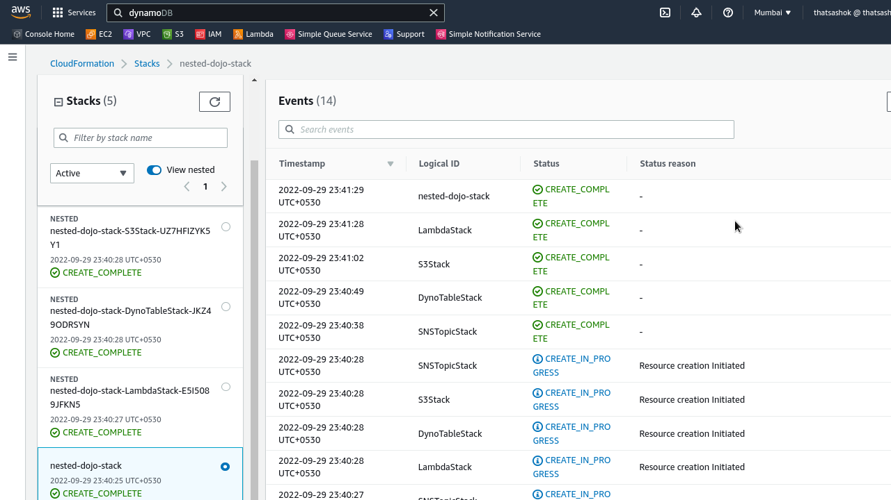
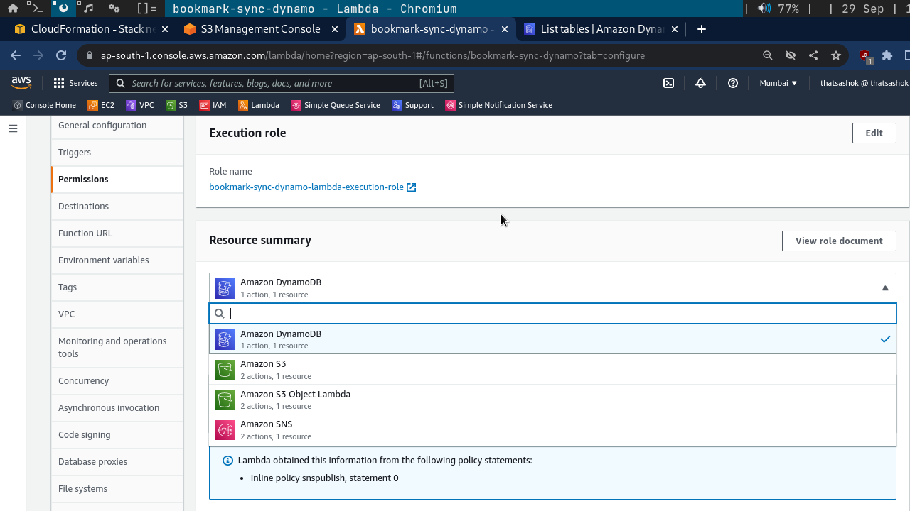
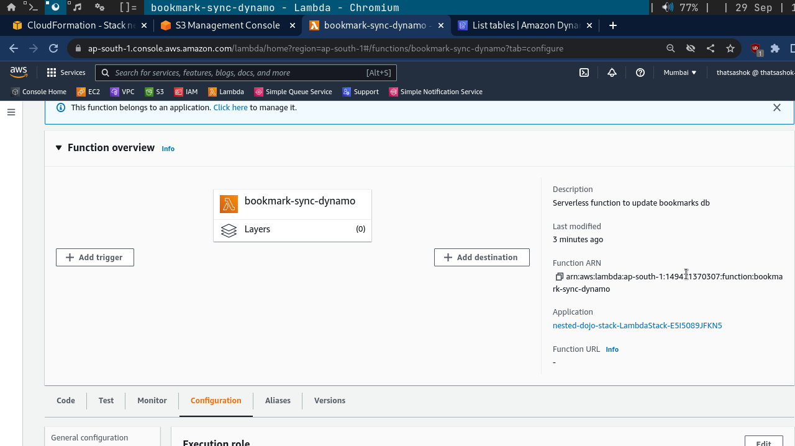
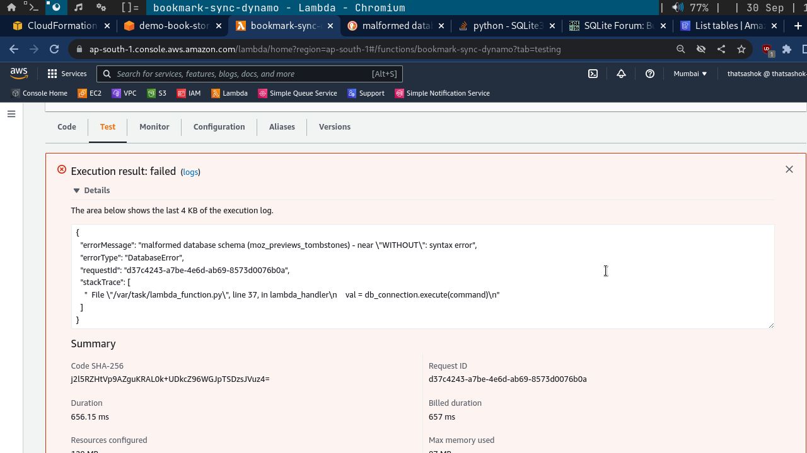

# Day-17 : Bookmarks Sync - Python - Lambda code completion and debugging

## Today's Update

### Stack deploys wonderfully



### Lambda deploys roles and code but fails in trigger integration

**Lambda Roles Deployed correctly**



**Lambda trigger no linking**



### Code works but throws input database error. Need to fix




**Python Code**

```python

#!/usr/bin/env python

import json
import time
import boto3
import sqlite3

table="Bookmarks-sync"

dynamo=boto3.client('dynamodb')

s3client = boto3.client('s3')

def get_file_s3(event):

    bucket = event['Records'][0]['s3']['bucket']['name']
    file = event['Records'][0]['s3']['object']['key']
    path = f"/tmp/{file}"

    s3client.download_file(
            Bucket=bucket,
            Key=file,
            Filename=path
            )

    return path

def lambda_handler(event, context):

    path=get_file_s3(event)

    db_connection = sqlite3.connect(path)

    command="SELECT url,description FROM MOZ_PLACES"

    val = db_connection.execute(command)

    for count, row in enumerate(val,start=1):

        url, description = row

        print(count, url)

        entry={
              "SNo": {
                "S": str(count)
              },
              "DateAddedTS": {
                "N": f"{round(time.time())}"
              },
              "Description": {
                "S": f"{description}"
              },
              "Link": {
                "S": url
              }
            }
        dynamo.put_item(
                TableName=table,
                Item=entry
                )

    db_connection.commit()

    db_connection.close()

    return {
        "status" : 200
        }
```

## Next Steps

- Debug code and solve db issue

## Social Proof

- Will post on **Discord** channels - 100daysofCloud & LearntoCloud
