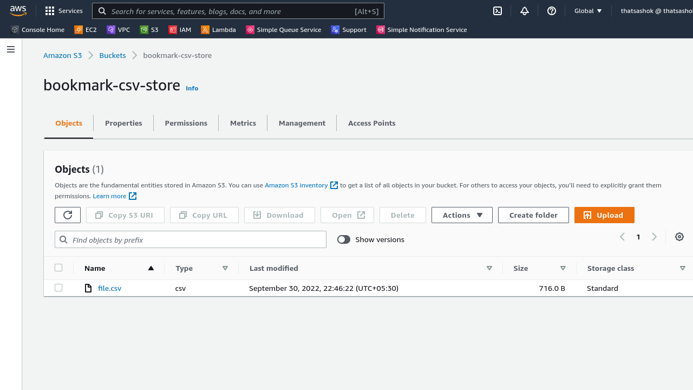
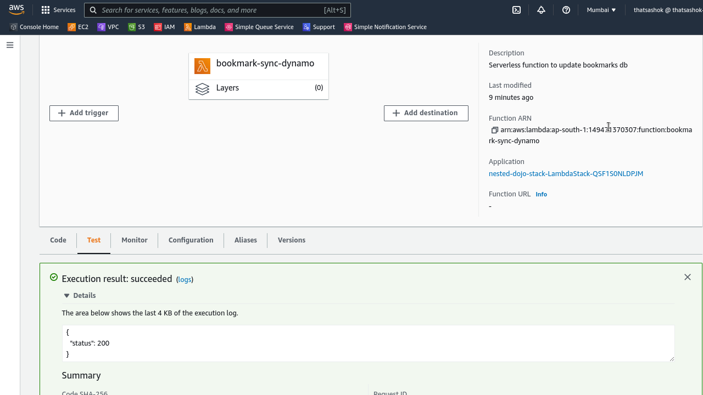
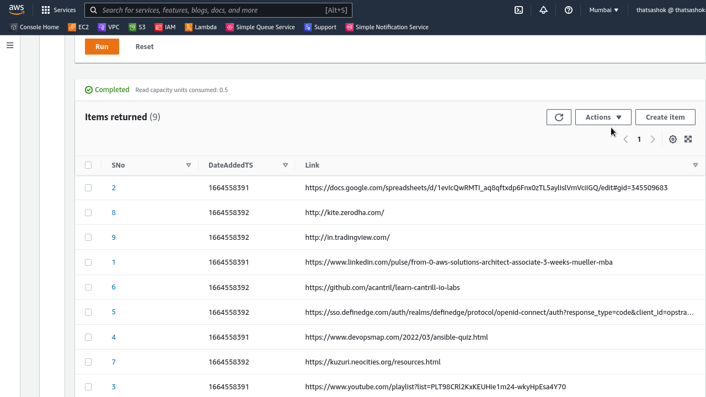

# Day-18 : Part-4 - Bookmark Sync - Make Lambda work with CSV and halt project

## Part-4 : Update and decided to halt project

- Had to abandon the places.sqlite upload idea to s3 after spending close to 3 hours searching for issues.
- For some reason it works locally in ``python 3.10.6`` and doesnot work in ``python 3.9`` in Lambda
- Moved to csv generation locally and upload to s3
- Process CSV file in Lambda and update Dynamodb

### CSV file creation locally from Firefox DB

```python
import sqlite3
import time
import boto3

def process_bookmarks(db_connection):

    command="SELECT url,description FROM MOZ_PLACES"

    val = db_connection.execute(command)

    with open('file.csv', 'w') as f:

        for count, row in enumerate(val,start=1):

            url, description = row

            print(count, url)

            f.write(f"{count},{url}\n")

    db_connection.commit()

    db_connection.close()

if __name__ == '__main__':

    path="places.sqlite"

    db_connection = sqlite3.connect(path)

    process_bookmarks(db_connection)
```

### Upload local csv to S3



### Lambda function works with below code



```python
#!/usr/bin/env python

import time
import boto3
import csv

table="Bookmarks-sync"

dynamo=boto3.client('dynamodb')

s3client = boto3.client('s3')

def get_file_s3(event):

    bucket = event['Records'][0]['s3']['bucket']['name']
    file = event['Records'][0]['s3']['object']['key']
    path = f"/tmp/{file}"

    s3client.download_file(
            Bucket=bucket,
            Key=file,
            Filename=path
            )

    return path

def lambda_handler(event, context):

    path=get_file_s3(event)

    with open(path,'r') as s3file:

        csv_reader = csv.reader(s3file, delimiter=",")

        for row in csv_reader:

            sno, url = row

            entry={
                  "SNo": {
                    "S": str(sno)
                  },
                  "DateAddedTS": {
                    "N": f"{round(time.time())}"
                  },
                  "Link": {
                    "S": url
                  }
                }
            dynamo.put_item(
                    TableName=table,
                    Item=entry
                    )

    return {
        "status" : 200
        }
```

### DynamoDB updated by Lambda function



## ☁️ Cloud Outcome - Lessons Learned

- Cloudformation Import and Export values are a big struggle with cross nested stack
- Cloudformation Wait and WaitHandle not understood completely
- Cloudformation DependsOn property is very handy in declaring stack deploy sequence

## Next Steps

- Resume project with more understanding as SAM or CDK exercise / State machine exercise

## Social Proof

- Will post on **Discord** channels - 100daysofCloud & LearntoCloud
