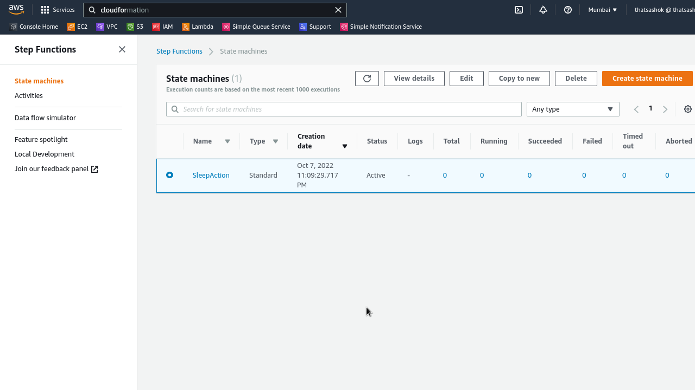

# Day-21 : CloudFormation and State Machines deployment

## Introduction

- This task today is to practice on Amazon States Language and Cloudformation with Lambda and Step Functions deployments as cross stacks

## Prerequisite

- Python
- CloudFormation
- Amazon States Language
- Step Functions / State Machines
- Lambda

## Hands On - Deploy a Step Function invoked Lambda via CloudFormation

### Step 1 — Make Cloudformation templates and ASL State Machine Code

**Lambda Stack :**
```yaml
---
Parameters:
  Function:
    Description: name of the lambda function
    Type: String
    Default: time-to-bed
  S3BucketParam:
    Type: String
    Default: naa-deployment-bucket
  S3KeyParam:
    Type: String
    Default: time2bed.zip

Resources:
  MyServerlessFunction:
    Type: AWS::Lambda::Function
    Properties:
      FunctionName: !Ref Function
      Description: Serverless function to work in state machine
      Architectures:
        - x86_64
      Runtime: python3.9
      Handler: lambda_function.lambda_handler
      Role: !GetAtt MyLambdaExecRole.Arn
      Timeout: 3
      Code:
        S3Bucket: !Ref S3BucketParam
        S3Key: !Ref S3KeyParam

  MyLambdaExecRole:
    Type: AWS::IAM::Role
    Properties:
      Description: Lambda function execution role
      RoleName: 
        !Join 
          - '-'
          - - !Ref Function
            - lambda
            - execution
            - role
      AssumeRolePolicyDocument:
        Statement:
          - Effect : Allow
            Principal:
              Service: 
                - lambda.amazonaws.com
            Action:
              - 'sts:AssumeRole'

Outputs:
  FuncDetails:
    Description: Lambda function for state machine
    Value: !GetAtt MyServerlessFunction.Arn
    Export:
      Name: StepFunctionArn
```
**Lambda handler :**
```python
#!/usr/bin/env python

import time

def lambda_handler(event, context):
    
    val = int(time.strftime('%H'))
    action = 'Work'

    if val > 23:
        action = 'Sleeep'
    else:
        action = 'RockIt'

    return {
        "action" : action
        }
```

**StateMachine Stack :**
```yaml
---
Parameters:
  StateMachineTitle:
    Description: name of the state machine
    Type: String
    Default: SleepAction
  S3BucketParam:
    Type: String
    Default: naa-deployment-bucket
  S3KeyParam:
    Type: String
    Default: time2bed.json

Resources:
  StateMachineDojo:
    Type: AWS::StepFunctions::StateMachine
    Properties:
      StateMachineName : !Ref StateMachineTitle
      DefinitionS3Location:
        Bucket: !Ref S3BucketParam
        Key: !Ref S3KeyParam
      DefinitionSubstitutions:
        LambdaStepFunc : !ImportValue StepFunctionArn
      RoleArn: !GetAtt MyStateMachineExecRole.Arn

  MyStateMachineExecRole:
    Type: AWS::IAM::Role
    Properties:
      Description: StateMachine Execution Role
      RoleName: 
        !Join 
          - '-'
          - - !Ref StateMachineTitle
            - statemachine
            - execution
            - role
      AssumeRolePolicyDocument:
        Statement:
          - Effect : Allow
            Principal:
              Service: 
                - !Sub states.${AWS::Region}.amazonaws.com
            Action:
              - 'sts:AssumeRole'
      Policies:
        - PolicyName: StateMachine2Lambda
          PolicyDocument:
            Statement:
              - Effect : Allow
                Action: 
                  - 'lambda:InvokeFunction'
                Resource: !ImportValue StepFunctionArn
```

**StateMachine ASL Code :**
```json
{
    "Comment" : "Practice state machine ASL code from scratch",
    "StartAt" : "Timecheck",
    "States" : {
        "Timecheck" : {
            "Type" : "Task",
            "Resource" : "${LambdaStepFunc}",
            "End" : true,
            "ResultPath" : "$.taskresult"
        }
    }
}
```

### Step 2 — Deploy the stacks in order ( Export / Import Values)

```console
$ aws cloudformation validate-template --template-body file:///$(pwd)/cfn-lambda.yaml
$ aws cloudformation validate-template --template-body file:///$(pwd)/cfn-state-machine.yaml
$ aws cloudformation create-stack --stack-name lambda-step --template-body file:///$(pwd)/cfn-lambda.yaml
$ aws cloudformation create-stack --stack-name step-fucn-stack --template-body file:///$(pwd)/cfn-state-machine.yaml
```

### Step 3 — Verify deployments in AWS Console

**Lambda Stack Deployed**


**Step Function Stack Deployed**




### Step 4 — Test by doing a random execution on state machine


## ☁️ Cloud Outcome

- Able to plan and deploy a serverless workflow in AWS CloudFormation using state machines / step functions and lambda

## Next Steps

- Work on complicated topics of workflow states and ASL

## Social Proof

- Will post on **Discord** channels - 100daysofCloud & LearntoCloud
